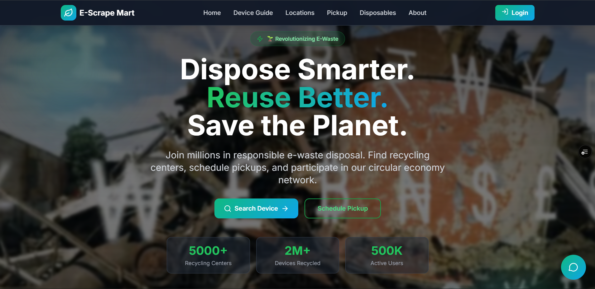

# E-Scrape Mart

E-Scrape Mart is a full-stack e-waste management platform that helps users:

- find safe disposal guidance for common electronic devices,
- discover verified recycling centers on an interactive map,
- schedule pickup and reuse workflows,
- and buy refurbished disposables through a guarded checkout flow.

The project combines a modern React frontend with a FastAPI backend and MongoDB data storage.

## Product Preview


## Why This Project Exists

E-waste is one of the fastest-growing waste streams globally. Most users still do not know:

- how to dispose of devices safely,
- where certified recycling centers exist,
- and what alternatives to disposal (repair, refurbish, reuse) are available.

E-Scrape Mart addresses this gap with one integrated user experience from awareness to action.

## Core Objectives

1. Make e-waste disposal practical and understandable.
2. Increase visibility of responsible recycling options.
3. Encourage circular economy behavior (reduce, reuse, recycle).
4. Support reuse through a refurbished device marketplace.

## Current Feature Set

### 1. Home Experience

- Hero section with the campaign message:
	- Dispose Smarter. Reuse Better. Save the Planet.
- Quick action entry points for searching devices and scheduling pickup.
- Animated impact counters and modern visual design.

### 2. Device Disposal Guide

- Searchable list of device types.
- Step-by-step disposal instructions.
- Safety warnings for hazardous items.
- Device-specific metadata and user-facing guidance.

### 3. Nearby Recycling Centers

- Interactive Leaflet map with custom markers.
- Location cards with ratings, services, contact details, and timings.
- Filter and sort options.
- Fixed India-first map starting viewport.

### 4. Pickup and Reuse Network

- Structured flow for pickup and reuse actions.
- Recycler/reuse pathway support.
- Form-driven UX with progress-oriented presentation.

### 5. Circular Economy Section

- Reduce -> Reuse -> Recycle educational flow.
- Impact-oriented presentation.
- CTA wired back to the home page.

### 6. Disposables Marketplace

- Refurbished products shown in responsive cards.
- Current layout: 3 cards per row on large screens.
- Wishlist-style interaction and product details.

### 7. Cart and Checkout

- Global cart state via context.
- Add to cart, remove, quantity updates, total calculation.
- Checkout screen with order summary and payment input flow.

### 8. Login-Gated Purchase Rules

- Users must be logged in to buy.
- Guest users clicking Buy are redirected to login.
- Checkout route is protected and shows login-required handling.

### 9. UI and Experience

- Dark-mode-only interface.
- Toast notifications for feedback.
- Floating chatbot for quick user assistance.
- Mobile-responsive navigation and section layouts.

## Tech Stack

### Frontend

- React 19
- Vite 8
- Tailwind CSS 3
- Framer Motion
- React Router DOM
- React Leaflet + Leaflet
- Lucide React icons

### Backend

- FastAPI
- Pydantic models
- PyMongo
- MongoDB Atlas

## Repository Structure

```text
HackMatrix_AI-Alchemists/
|- Backend/
|  |- Main.py
|  |- Configrations/
|  |- config/
|  |- Models/
|  |- Routes/
|  |- Services/
|  |- schemas/
|  |- Schemes/
|
|- Code/
|  |- index.html
|  |- package.json
|  |- public/
|  |  |- favicon.svg
|  |- src/
|     |- App.jsx
|     |- context/CartContext.jsx
|     |- components/
|     |- pages/
```

## Frontend Architecture Summary

- App-level route orchestration lives in `Code/src/App.jsx`.
- Global cart state is provided via `CartProvider`.
- Pages are route-level wrappers.
- Reusable feature modules are organized under `src/components`.
- Local browser storage is used for lightweight persistence.

### LocalStorage Keys Used

- `darkMode`
- `isLoggedIn`
- `cartItems`
- `deviceImages`
- `customDisposables`

## Backend Architecture Summary

### Layering

- `Routes/` exposes API endpoints.
- `Services/` contains database interaction logic.
- `Models/` defines request payloads using Pydantic.
- `schemas/` and `Schemes/` serialize Mongo documents.

### API Routers Mounted

- `/devices`
- `/centers`

## API Reference (Current)

### Base

- Local: `http://127.0.0.1:8000`

### Health / Root

- `GET /`
- Response:

```json
{
	"message": "E-Waste API Running 🚀"
}
```

### Devices

- `GET /devices/`
	- Returns all device records.
- `POST /devices/`
	- Creates a device.

Request body:

```json
{
	"name": "Laptop",
	"category": "Electronics",
	"disposal_instructions": "Remove battery and hand over to certified e-waste recycler"
}
```

### Centers

- `GET /centers/`
	- Returns all center records.
- `POST /centers/`
	- Creates a recycling center.

Request body:

```json
{
	"name": "Green Cycle Delhi",
	"address": "Holambi Kalan, Delhi",
	"latitude": 28.5921,
	"longitude": 77.3693,
	"verified": true
}
```

## Setup Guide

### Prerequisites

- Node.js 18+
- npm 9+
- Python 3.10+
- MongoDB Atlas (or a MongoDB instance)

### 1) Frontend Setup

```bash
cd Code
npm install
npm run dev
```

Vite will print the URL in terminal (typically `http://localhost:5173` or `http://localhost:5174`).

### 2) Backend Setup

From project root:

```bash
pip install fastapi uvicorn pymongo pydantic
uvicorn Backend.Main:app --reload
```

Backend will run at `http://127.0.0.1:8000`.

### 3) Database Configuration

The MongoDB connection is configured in `Backend/Configrations/mongoDB.py`.

Replace placeholder credentials in the `MONGO_URI` string with valid values before production use.

## Run Both Together

1. Start backend server.
2. Start frontend dev server.
3. Open frontend URL and use the UI; frontend and backend can evolve independently.

## End-to-End User Flow

1. User opens home page.
2. Searches for a device and reads disposal guidance.
3. Checks nearby recycling centers on map.
4. Optionally schedules pickup.
5. Browses disposables marketplace.
6. If not logged in, buy action redirects to login.
7. Logged-in user adds items to cart and proceeds to checkout.

## Branding and Assets

- Product name: E-Scrape Mart
- Favicon: SVG in `Code/public/favicon.svg`
- Hero preview image used in this README: `Code/src/assets/hero.png`

## Known Notes

- Frontend currently keeps user auth state in local storage for demo flow.
- Backend API is focused on devices and centers; marketplace/order persistence is client-driven in current version.

## Future Improvements

- Add JWT-based authentication and protected backend endpoints.
- Persist cart/orders to backend.
- Add pagination/filter APIs for centers/devices.
- Add automated tests (frontend + backend).
- Add CI pipeline for lint/build/test.

## Quick Commands

Frontend:

```bash
cd Code
npm run dev
npm run build
npm run preview
```

Backend:

```bash
uvicorn Backend.Main:app --reload
```

---

Built for HackMatrix with a focus on practical sustainability and circular economy adoption.
