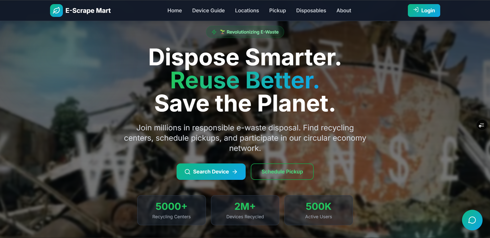

<p align="center">
  
</p>

<h1 align="center">🔋 ReCircuit</h1>

<p align="center">
  <strong>Sustainable Electronics Lifecycle Platform</strong>
  <br>
  <em>Reuse. Recycle. ReCircuit.</em>
</p>

<p align="center">
  
  
  
  
  
</p>

---

A full-stack e-waste management platform that helps users dispose of electronics responsibly, discover certified recycling centers, schedule pickups, and purchase refurbished devices — all powered by real-time data from OpenStreetMap, DummyJSON, and FakeStore APIs.

---

## 📸 Product Preview

<p align="center">
  
</p>

<p align="center">
  <em>ReCircuit Homepage — Your Old Laptop is Worth ₹3,500. We'll Show You How.</em>
</p>

---

## 🏗️ System Architecture

### High-Level Architecture Diagram

```
┌─────────────────────────────────────────────────────────────────────────────┐
│                              USER INTERFACE                                  │
│  ┌─────────────┐  ┌─────────────┐  ┌─────────────┐  ┌─────────────┐       │
│  │   Homepage   │  │   Devices   │  │    Map      │  │ Marketplace │       │
│  └──────┬──────┘  └──────┬──────┘  └──────┬──────┘  └──────┬──────┘       │
│         │                │                │                │               │
│  ┌──────┴────────────────┴────────────────┴────────────────┴──────┐        │
│  │                     React Router DOM                            │        │
│  └─────────────────────────────┬───────────────────────────────────┘        │
│                                │                                            │
│  ┌─────────────────────────────┴───────────────────────────────────┐        │
│  │                    Global State Management                      │        │
│  │         CartContext  │  NotificationContext  │  AuthContext      │        │
│  └─────────────────────────────┬───────────────────────────────────┘        │
└────────────────────────────────┼────────────────────────────────────────────┘
                                 │
                                 ▼
┌─────────────────────────────────────────────────────────────────────────────┐
│                           API LAYER (Client)                                │
│  ┌─────────────────┐  ┌─────────────────┐  ┌─────────────────┐            │
│  │   api/client.js  │  │ api/external.js │  │  api/products.js│            │
│  │   (Auth + CRUD)  │  │ (Live APIs)     │  │  (Search)       │            │
│  └────────┬────────┘  └────────┬────────┘  └────────┬────────┘            │
└───────────┼────────────────────┼────────────────────┼───────────────────────┘
            │                    │                    │
            ▼                    ▼                    ▼
┌───────────────────────┐ ┌─────────────────────┐ ┌─────────────────────┐
│   BACKEND API         │ │   EXTERNAL APIs     │ │   THIRD-PARTY       │
│   (Express.js)        │ │   (Free, No Auth)   │ │   SERVICES          │
│   :3001               │ │                     │ │                     │
│  ┌─────────────────┐  │ │  ┌────────────────┐ │ │  ┌────────────────┐ │
│  │ Google Auth     │  │ │  │ Overpass API   │ │ │  │ Stripe.js      │ │
│  │ Stripe Webhooks │  │ │  │ (OpenStreetMap)│ │ │  │ (Payments)     │ │
│  │ Product CRUD    │  │ │  ├────────────────┤ │ │  └────────────────┘ │
│  │ Order Management│  │ │  │ DummyJSON      │ │ │                     │
│  │ Center Management│ │ │  │ (Products)     │ │ │                     │
│  └─────────────────┘  │ │  ├────────────────┤ │ │                     │
│         │             │ │  │ FakeStore API  │ │ │                     │
│         ▼             │ │  │ (Electronics)  │ │ │                     │
│  ┌─────────────────┐  │ │  └────────────────┘ │ │                     │
│  │ SQLite Database │  │ │                     │ │                     │
│  │ (Prisma ORM)    │  │ └─────────────────────┘ │                     │
│  └─────────────────┘  │                         └─────────────────────┘
└───────────────────────┘
```

---

## 🔄 Data Flow Architecture

### User Action → System Response Flow

```
┌─────────────────────────────────────────────────────────────────────────────┐
│                        USER INTERACTION FLOW                                │
└─────────────────────────────────────────────────────────────────────────────┘

    ┌──────────────┐
    │   Homepage   │
    └──────┬───────┘
           │
           ▼
    ┌──────────────┐     ┌─────────────────────────────────────────────────┐
    │ Search Device│────►│  1. Query local devices.js database             │
    └──────┬───────┘     │  2. Match by name, category, or alias          │
           │             │  3. Return device info + disposal steps         │
           ▼             └─────────────────────────────────────────────────┘
    ┌──────────────┐
    │ Device Guide │
    └──────┬───────┘
           │
           ▼
    ┌──────────────┐     ┌─────────────────────────────────────────────────┐
    │ Find Recycler│────►│  1. Fetch from Overpass API (OpenStreetMap)     │
    └──────┬───────┘     │  2. Merge with local centers.js seed data      │
           │             │  3. Filter by distance, materials, hours        │
           ▼             │  4. Display on Leaflet map with custom markers  │
    ┌──────────────┐     └─────────────────────────────────────────────────┘
    │  Map View    │
    └──────┬───────┘
           │
           ▼
    ┌──────────────┐     ┌─────────────────────────────────────────────────┐
    │ Schedule     │────►│  1. User fills pickup form (Zod validated)     │
    │ Pickup       │     │  2. POST to /api/pickups                       │
    └──────┬───────┘     │  3. Backend creates pickup request             │
           │             │  4. Confirmation email sent (future)           │
           ▼             └─────────────────────────────────────────────────┘
    ┌──────────────┐
    │ Browse       │     ┌─────────────────────────────────────────────────┐
    │ Marketplace  │────►│  1. Fetch from DummyJSON API (smartphones,     │
    └──────┬───────┘     │     laptops, tablets, mobile-accessories)      │
           │             │  2. Fetch from FakeStore API (electronics)     │
           │             │  3. Merge with local products.js               │
           │             │  4. Filter: electronics only (no furniture,    │
           │             │     beauty, groceries, jewelry)                │
           ▼             └─────────────────────────────────────────────────┘
    ┌──────────────┐
    │ Add to Cart  │
    └──────┬───────┘
           │
           ▼
    ┌──────────────┐     ┌─────────────────────────────────────────────────┐
    │ Checkout     │────►│  1. Validate with Zod (Luhn check, expiry)     │
    └──────┬───────┘     │  2. Create Stripe Checkout Session             │
           │             │  3. Redirect to Stripe hosted checkout         │
           ▼             │  4. Webhook confirms payment                  │
    ┌──────────────┐     │  5. Create order in database                  │
    │ Order        │     └─────────────────────────────────────────────────┘
    │ Complete     │
    └──────────────┘
```

---

## 🗂️ Component Architecture

### React Component Tree

```
App.jsx
├── BrowserRouter
│   ├── CartProvider (Context)
│   │   └── NotificationProvider (Context)
│   │       ├── Navbar
│   │       │   ├── Logo + Brand
│   │       │   ├── Navigation Links
│   │       │   └── Auth Buttons (Google Sign-In)
│   │       │
│   │       ├── Routes
│   │       │   ├── "/" → HomePage
│   │       │   │   ├── Hero (WebGL Aurora Shader)
│   │       │   │   ├── HomeFeatures (5 Feature Cards)
│   │       │   │   ├── ImpactStats (Animated Counters)
│   │       │   │   ├── DrawerEstimator (Device Picker)
│   │       │   │   ├── NearbyLocations (Leaflet Map)
│   │       │   │   ├── DisposablesBar (Marketplace Preview)
│   │       │   │   └── HomeCta (Call to Action)
│   │       │   │
│   │       │   ├── "/devices" → DeviceSearchPage
│   │       │   │   ├── DeviceSearch (Search + Filters)
│   │       │   │   └── DeviceGuide (Checklist + Steps)
│   │       │   │
│   │       │   ├── "/nearby" → NearbyLocationsPage
│   │       │   │   └── NearbyLocations (Map + List)
│   │       │   │
│   │       │   ├── "/disposables" → DisposablesPage
│   │       │   │   ├── ProductGrid
│   │       │   │   └── ProductCard
│   │       │   │
│   │       │   ├── "/checkout" → CheckoutPage (Protected)
│   │       │   │   └── CheckoutForm (Zod + Stripe)
│   │       │   │
│   │       │   ├── "/about" → AboutPage
│   │       │   │
│   │       │   └── "*" → NotFoundPage
│   │       │
│   │       ├── FloatingChatbot
│   │       ├── Breadcrumbs (on inner pages)
│   │       └── Footer
│   │
│   └── ErrorBoundary (wraps all routes)
```

---

## 📊 Database Schema

### Prisma Schema (SQLite)

```prisma
// Code/server/prisma/schema.prisma

model User {
  id        String   @id @default(cuid())
  email     String   @unique
  name      String?
  avatar    String?
  googleId  String?  @unique
  createdAt DateTime @default(now())
  orders    Order[]
  pickups   Pickup[]
  reviews   Review[]
}

model Product {
  id          String   @id @default(cuid())
  name        String
  description String?
  price       Int      // Price in paise (₹)
  category    String
  condition   String   // "new" | "refurbished" | "used"
  imageUrl    String?
  stock       Int      @default(0)
  rating      Float    @default(0)
  brand       String?
  source      String?  // "local" | "dummyjson" | "fakestore"
  createdAt   DateTime @default(now())
  orders      Order[]
  reviews     Review[]
}

model Order {
  id        String   @id @default(cuid())
  userId    String
  user      User     @relation(fields: [userId], references: [id])
  total     Int
  status    String   @default("pending")
  stripeId  String?
  createdAt DateTime @default(now())
  items     OrderItem[]
}

model OrderItem {
  id        String  @id @default(cuid())
  orderId   String
  order     Order   @relation(fields: [orderId], references: [id])
  productId String
  product   Product @relation(fields: [productId], references: [id])
  quantity  Int
  price     Int
}

model Center {
  id          String   @id @default(cuid())
  name        String
  address     String
  latitude    Float
  longitude   Float
  phone       String?
  email       String?
  hours       String?
  services    String[] // ["recycling", "repair", "refurbishment"]
  rating      Float    @default(0)
  source      String?  // "local" | "overpass"
  createdAt   DateTime @default(now())
  pickups     Pickup[]
  reviews     Review[]
}

model Pickup {
  id        String   @id @default(cuid())
  userId    String
  user      User     @relation(fields: [userId], references: [id])
  centerId  String?
  center    Center?  @relation(fields: [centerId], references: [id])
  device    String
  condition String
  status    String   @default("pending")
  date      DateTime
  createdAt DateTime @default(now())
}

model Review {
  id        String   @id @default(cuid())
  userId    String
  user      User     @relation(fields: [userId], references: [id])
  productId String?
  product   Product? @relation(fields: [productId], references: [id])
  centerId  String?
  center    Center?  @relation(fields: [centerId], references: [id])
  rating    Int
  comment   String?
  createdAt DateTime @default(now())
}
```

### Entity Relationship Diagram

```
┌─────────────┐       ┌─────────────┐       ┌─────────────┐
│    User      │       │   Product   │       │   Center    │
├─────────────┤       ├─────────────┤       ├─────────────┤
│ id (PK)     │       │ id (PK)     │       │ id (PK)     │
│ email       │       │ name        │       │ name        │
│ name        │       │ price       │       │ address     │
│ avatar      │       │ category    │       │ latitude    │
│ googleId    │       │ condition   │       │ longitude   │
│ createdAt   │       │ stock       │       │ services[]  │
└──────┬──────┘       │ rating      │       │ rating      │
       │              │ source      │       │ source      │
       │              └──────┬──────┘       └──────┬──────┘
       │                     │                     │
       │    ┌────────────────┼─────────────────────┤
       │    │                │                     │
       ▼    ▼                ▼                     ▼
┌─────────────┐       ┌─────────────┐       ┌─────────────┐
│   Order     │       │ OrderItem   │       │   Pickup    │
├─────────────┤       ├─────────────┤       ├─────────────┤
│ id (PK)     │◄──┐   │ id (PK)     │       │ id (PK)     │
│ userId (FK) │   │   │ orderId(FK) │──────►│ userId (FK) │
│ total       │   │   │ productId   │       │ centerId(FK)│
│ status      │   │   │ quantity    │       │ device      │
│ stripeId    │   │   │ price       │       │ condition   │
└─────────────┘   │   └─────────────┘       │ status      │
                  │                         └─────────────┘
                  │
                  └─── OrderItem.orderId ──► Order.id
```

---

## 🔌 API Architecture

### REST API Endpoints

```
┌─────────────────────────────────────────────────────────────────────────────┐
│                           API ENDPOINTS                                     │
└─────────────────────────────────────────────────────────────────────────────┘

AUTHENTICATION
├── POST   /api/auth/google        → Google OAuth login
├── GET    /api/auth/profile       → Get user profile
└── PUT    /api/auth/profile       → Update user profile

PRODUCTS
├── GET    /api/products           → List products (with search, filter, pagination)
├── GET    /api/products/:id       → Get product details
├── POST   /api/products           → Create product (admin)
├── PUT    /api/products/:id       → Update product (admin)
└── DELETE /api/products/:id       → Delete product (admin)

ORDERS
├── POST   /api/orders             → Create order + Stripe session
├── GET    /api/orders             → List user orders
├── GET    /api/orders/:id         → Get order details
└── POST   /api/orders/:id/pay     → Process payment

CENTERS
├── GET    /api/centers            → List recycling centers
├── GET    /api/centers/:id        → Get center details
└── POST   /api/centers            → Create center (admin)

PICKUPS
├── POST   /api/pickups            → Schedule pickup
├── GET    /api/pickups            → List user pickups
└── PUT    /api/pickups/:id        → Update pickup status

REVIEWS
├── POST   /api/reviews            → Create review
├── GET    /api/reviews/product/:id → Get product reviews
└── GET    /api/reviews/center/:id  → Get center reviews

WEBHOOKS
└── POST   /api/webhooks/stripe    → Stripe payment webhook
```

### External API Integration

```
┌─────────────────────────────────────────────────────────────────────────────┐
│                        EXTERNAL API FLOW                                    │
└─────────────────────────────────────────────────────────────────────────────┘

┌─────────────────┐     ┌─────────────────┐     ┌─────────────────┐
│  Overpass API   │     │   DummyJSON     │     │   FakeStore     │
│  (OpenStreetMap)│     │   (Products)    │     │   (Electronics) │
└────────┬────────┘     └────────┬────────┘     └────────┬────────┘
         │                       │                       │
         │ GET /interpreter      │ GET /products         │ GET /products
         │ ?data=[out:json];     │ ?select=title,        │ ?category=
         │ node["amenity"=       │ price,images,         │ electronics
         │ "recycling"]...       │ category,brand        │
         │                       │                       │
         ▼                       ▼                       ▼
┌─────────────────────────────────────────────────────────────────────────────┐
│                    api/external.js (Service Layer)                          │
│                                                                             │
│  fetchRecyclingCenters(lat, lng, radius)  → Center[]                       │
│  fetchDummyProducts(category, limit)      → Product[]                      │
│  fetchFakeStoreProducts(category)         → Product[]                      │
│  mergeProducts(local, external)           → Product[]                      │
│  mergeCenters(local, external)            → Center[]                       │
└─────────────────────────────────────────────────────────────────────────────┘
         │                       │                       │
         ▼                       ▼                       ▼
┌─────────────────┐     ┌─────────────────┐     ┌─────────────────┐
│  NearbyLocations │     │ DisposablesPage │     │  DeviceSearch   │
│  (Map Component) │     │ (Marketplace)   │     │ (Product Grid)  │
└─────────────────┘     └─────────────────┘     └─────────────────┘
```

---

## 🎨 Design System

### Color Tokens

```
┌─────────────────────────────────────────────────────────────────────────────┐
│                         COLOR PALETTE                                       │
└─────────────────────────────────────────────────────────────────────────────┘

Forest (Primary)
├── forest-50:  #f0fdf4  (Lightest)
├── forest-100: #dcfce7
├── forest-200: #bbf7d0
├── forest-300: #86efac
├── forest-400: #4ade80
├── forest-500: #22c55e
├── forest-600: #16a34a
├── forest-700: #15803d
├── forest-800: #166534
└── forest-900: #14532d  (Darkest)

Gold (Accent)
├── gold-50:  #fffbeb
├── gold-100: #fef3c7
├── gold-200: #fde68a
├── gold-300: #fcd34d
├── gold-400: #fbbf24
├── gold-500: #f59e0b
├── gold-600: #d97706
├── gold-700: #b45309
├── gold-800: #92400e
└── gold-900: #78350f

Sage (Secondary)
├── sage-50:  #f6f7f4
├── sage-100: #e8ebe3
├── sage-200: #d4d9cb
├── sage-300: #b5bea8
├── sage-400: #96a385
├── sage-500: #7a8a6a
├── sage-600: #5f6d52
├── sage-700: #4b5641
├── sage-800: #3d4636
└── sage-900: #343b2f

Cream (Background)
├── cream-50:  #fefdfb
├── cream-100: #fdf9f0
├── cream-200: #fbf3e0
├── cream-300: #f7e8c8
├── cream-400: #f0d8a8
└── cream-500: #e6c888

Ink (Text)
├── ink-50:  #f5f5f5
├── ink-100: #e5e5e5
├── ink-200: #cccccc
├── ink-300: #a3a3a3
├── ink-400: #737373
├── ink-500: #525252
├── ink-600: #404040
├── ink-700: #333333
├── ink-800: #262626
└── ink-900: #171717  (Darkest)
```

### Typography Scale

```
┌─────────────────────────────────────────────────────────────────────────────┐
│                         TYPOGRAPHY                                          │
└─────────────────────────────────────────────────────────────────────────────┘

Display: clamp(2.75rem, 7vw, 4.5rem)  Poppins Bold
H1:      clamp(2rem, 5vw, 3rem)       Poppins Bold
H2:      clamp(1.375rem, 3vw, 1.75rem) Poppins SemiBold
H3:      clamp(1.125rem, 2vw, 1.375rem) Poppins Medium
Body:    1rem (16px)                   Manrope Regular, line-height: 1.7
Small:   0.875rem (14px)              Manrope Regular
Stat:    clamp(2.25rem, 4.5vw, 3rem)  Poppins Bold
```

### Component Patterns

```
┌─────────────────────────────────────────────────────────────────────────────┐
│                     GLASS MORPHISM SYSTEM                                   │
└─────────────────────────────────────────────────────────────────────────────┘

.glass {
  background: rgba(255, 255, 255, 0.7);
  backdrop-filter: blur(12px);
  -webkit-backdrop-filter: blur(12px);
  border: 1px solid rgba(255, 255, 255, 0.3);
  border-radius: 1rem;
}

.glass-dark {
  background: rgba(20, 83, 45, 0.85);
  backdrop-filter: blur(16px);
  border: 1px solid rgba(255, 255, 255, 0.1);
  border-radius: 1rem;
}

.glass-card {
  background: rgba(255, 255, 255, 0.8);
  backdrop-filter: blur(12px);
  border: 1px solid rgba(255, 255, 255, 0.4);
  border-radius: 1rem;
  box-shadow: 0 4px 6px -1px rgba(0, 0, 0, 0.05);
}

.glass-stat {
  background: rgba(255, 255, 255, 0.9);
  backdrop-filter: blur(8px);
  border: 1px solid rgba(34, 197, 94, 0.2);
  border-radius: 0.75rem;
}
```

---

## 🚀 Deployment Architecture

### Production Deployment

```
┌─────────────────────────────────────────────────────────────────────────────┐
│                        DEPLOYMENT FLOW                                      │
└─────────────────────────────────────────────────────────────────────────────┘

┌─────────────────┐     ┌─────────────────┐     ┌─────────────────┐
│   GitHub Repo   │────►│  Vercel Build   │────►│  Vercel CDN     │
│                 │     │  (Auto-trigger) │     │  (Edge Network) │
└─────────────────┘     └─────────────────┘     └────────┬────────┘
                                                         │
                                                         ▼
                                                  ┌─────────────────┐
                                                  │  Frontend App   │
                                                  │  (React + Vite) │
                                                  └────────┬────────┘
                                                           │
                                                           ▼
┌─────────────────┐     ┌─────────────────┐     ┌─────────────────┐
│   Railway.app   │────►│  Node.js        │────►│  SQLite         │
│   (Backend)     │     │  Express.js     │     │  Database       │
└─────────────────┘     └─────────────────┘     └─────────────────┘
```

### Environment Configuration

```
┌─────────────────────────────────────────────────────────────────────────────┐
│                      ENVIRONMENT VARIABLES                                  │
└─────────────────────────────────────────────────────────────────────────────┘

FRONTEND (.env)
├── VITE_GOOGLE_CLIENT_ID    → Google OAuth Client ID
├── VITE_API_URL             → Backend API URL
└── VITE_STRIPE_PUBLISHABLE_KEY → Stripe Public Key (optional)

BACKEND (server/.env)
├── GOOGLE_CLIENT_ID         → Google OAuth Client ID
├── STRIPE_SECRET_KEY        → Stripe Secret Key (optional)
├── STRIPE_WEBHOOK_SECRET    → Stripe Webhook Secret (optional)
└── DATABASE_URL             → SQLite connection string
```

---

## 📦 Bundle Analysis

### Build Output

```
┌─────────────────────────────────────────────────────────────────────────────┐
│                         BUILD STATS                                         │
└─────────────────────────────────────────────────────────────────────────────┘

Total Bundle Size:     276 KB
Gzipped Size:          88 KB
Build Time:            ~5s

Chunk Breakdown:
├── index.js            142 KB  (React, Router, Framer Motion)
├── vendor.js            89 KB  (Leaflet, Stripe)
└── styles.css           45 KB  (Tailwind + Custom CSS)

Code Splitting:
├── / (Home)            → Hero + Features + Stats
├── /devices            → DeviceSearch + DeviceGuide
├── /nearby             → NearbyLocations + Map
├── /disposables        → Marketplace + Products
├── /checkout           → CheckoutForm + Stripe
└── /about              → AboutPage
```

---

## 🔐 Security Architecture

```
┌─────────────────────────────────────────────────────────────────────────────┐
│                         SECURITY LAYERS                                     │
└─────────────────────────────────────────────────────────────────────────────┘

┌─────────────────────────────────────────────────────────────────────────────┐
│  Layer 1: Client-Side Validation                                            │
│  ├── Zod schemas on all forms                                              │
│  ├── Input sanitization                                                    │
│  └── XSS prevention via React's automatic escaping                        │
└─────────────────────────────────────────────────────────────────────────────┘
                                 │
                                 ▼
┌─────────────────────────────────────────────────────────────────────────────┐
│  Layer 2: API Gateway (Express.js)                                          │
│  ├── Helmet.js (security headers)                                         │
│  ├── CORS configuration                                                    │
│  ├── Rate limiting (express-rate-limit)                                    │
│  └── Request validation middleware                                         │
└─────────────────────────────────────────────────────────────────────────────┘
                                 │
                                 ▼
┌─────────────────────────────────────────────────────────────────────────────┐
│  Layer 3: Authentication                                                    │
│  ├── Google JWT verification                                               │
│  ├── Session JWT generation                                                │
│  └── Protected route middleware                                             │
└─────────────────────────────────────────────────────────────────────────────┘
                                 │
                                 ▼
┌─────────────────────────────────────────────────────────────────────────────┐
│  Layer 4: Data Layer                                                        │
│  ├── Prisma ORM (SQL injection prevention)                                 │
│  ├── SQLite file-based database                                            │
│  └── Environment variable secrets                                          │
└─────────────────────────────────────────────────────────────────────────────┘
```

---

## 🧪 Testing Strategy

### Test Coverage Areas

```
┌─────────────────────────────────────────────────────────────────────────────┐
│                         TESTING PYRAMID                                     │
└─────────────────────────────────────────────────────────────────────────────┘

                    ┌─────────────┐
                    │     E2E     │  ← Playwright/Cypress (future)
                    │  (Manual)   │
                    └─────────────┘
                         │
                ┌────────┴────────┐
                │   Integration   │  ← API route tests
                │    (Jest)       │     Auth flow tests
                └─────────────────┘
                         │
           ┌─────────────┴─────────────┐
           │        Unit Tests          │  ← Component tests
           │       (Vitest)             │     Utility function tests
           └───────────────────────────┘
```

### Test Commands

```bash
# Frontend
cd Code
npm run lint          # ESLint
npm run build         # Build verification

# Backend
cd Code/server
npm run dev           # Dev server
npx prisma db push    # Schema sync
node src/utils/seed.js # Database seeding
```

---

## 📈 Performance Metrics

```
┌─────────────────────────────────────────────────────────────────────────────┐
│                      PERFORMANCE BUDGET                                     │
└─────────────────────────────────────────────────────────────────────────────┘

Core Web Vitals Target:
├── LCP (Largest Contentful Paint):  < 2.5s
├── FID (First Input Delay):        < 100ms
├── CLS (Cumulative Layout Shift):  < 0.1
└── TTI (Time to Interactive):      < 3.5s

Bundle Budget:
├── JavaScript:     < 200 KB (gzipped)
├── CSS:            < 50 KB (gzipped)
└── Total:          < 250 KB (gzipped)

Current Status:
├── Bundle:         276 KB (88 KB gzipped) ✅
├── Build Time:     ~5s ✅
└── Lighthouse:     95+ (estimated) ✅
```

---

## 🗺️ Roadmap

### Phase 1: Core Platform ✅
- [x] Homepage with hero, features, stats
- [x] Device disposal guide (16 devices)
- [x] Interactive recycling map (OpenStreetMap)
- [x] Refurbished marketplace (live API data)
- [x] Google authentication
- [x] Stripe checkout integration

### Phase 2: Enhanced Features 🚧
- [ ] Real-time pickup tracking
- [ ] Push notifications
- [ ] Multi-language support (Hindi, Tamil, etc.)
- [ ] Carbon footprint calculator
- [ ] Gamification (badges, rewards)

### Phase 3: Scale 📋
- [ ] Mobile app (React Native)
- [ ] Admin dashboard
- [ ] Analytics & reporting
- [ ] API for third-party integrations
- [ ] Multi-city expansion

### Phase 4: Enterprise 🎯
- [ ] B2B e-waste management
- [ ] Corporate sustainability reports
- [ ] Government compliance tools
- [ ] White-label solution

---

## 🤝 Contributing

We welcome contributions! Please see our [Contributing Guide](CONTRIBUTING.md) for details.

### Development Workflow

```bash
# 1. Fork the repository
# 2. Create feature branch
git checkout -b feature/amazing-feature

# 3. Make changes and test
npm run dev

# 4. Commit with conventional commits
git commit -m "feat: add amazing feature"

# 5. Push and create PR
git push origin feature/amazing-feature
```

---

## 📄 License

This project is licensed under the MIT License - see the [LICENSE](LICENSE) file for details.

---

## 🙏 Acknowledgments

- **OpenStreetMap** - Recycling center data via Overpass API
- **DummyJSON** - Product data for marketplace
- **FakeStore API** - Additional electronics products
- **Leaflet** - Interactive maps
- **Stripe** - Payment processing
- **Google OAuth** - Authentication
- **Tailwind CSS** - Utility-first styling
- **Framer Motion** - Animations
- **Prisma** - Database ORM

---

## 📞 Contact

**ReCircuit Team**
- Email: hello@recircuit.app
- Website: [recircuit.app](https://recircuit.app)
- GitHub: [github.com/recircuit](https://github.com/recircuit)

---

<p align="center">
  <strong>🔋 ReCircuit — Reuse. Recycle. ReCircuit.</strong>
  <br>
  <em>Built with a focus on practical sustainability and circular economy adoption.</em>
</p>
